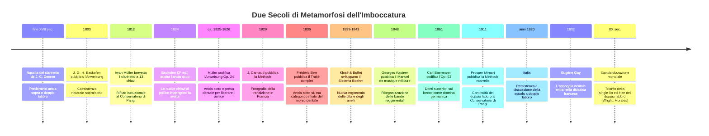

# SOTTOSOPRA

## Come il clarinetto ha girato l'ancia (e la storia)
### Saggio storico-organologico sull'evoluzione dell'embouchure: dall'ancia sopra al doppio labbro e alla presa dentale tra meccanica, scuole nazionali e banda militare

---

> ### 📌 Nota metodologica ed epistemologica
>
> La moderna storiografia organologica impone di distinguere con chiarezza tre configurazioni fisiologiche che troppo spesso sono state confuse in una generica contrapposizione binaria:
>
> 1. **Ancia rivolta verso l'alto (*Obersichblasen*) con doppio labbro storico:** entrambe le labbra ricoprono le arcate dentarie; nessun dente tocca la superficie dura del bocchino;
> 2. **Ancia rivolta verso il basso (*Untersichblasen*) con doppio labbro:** l'ancia vibra sul labbro inferiore, ma anche il labbro superiore è ripiegato sui denti incisivi superiori senza contatto osseo diretto con il dorso del becco;
> 3. **Ancia rivolta verso il basso (*Untersichblasen*) con presa dentale (*single-lip*):** l'ancia vibra sul labbro inferiore e i denti incisivi superiori poggiano direttamente sul dorso rigido del bocchino.
>
> La grande metamorfosi storica non è quindi semplicemente il passaggio da *ancia sopra* ad *ancia sotto*, ma soprattutto la transizione successiva — durata oltre un secolo e guidata da profonde ragioni ergonomiche, estetiche e meccaniche — dal **doppio labbro all'ancoraggio dentale**.

---

## Prologo — Uno strumento nato "al contrario": il problema nella bocca

Il clarinetto nasce sul finire del XVII secolo a Norimberga dall'opera di Johann Christoph Denner, che perfeziona lo *chalumeau*, uno strumento popolare a canna cilindrica con poche chiavi e una singola lamella di canna legata al becco. Nei suoi primi decenni di vita, il clarinetto è uno strumento leggero, cameristico, dotato di sole due o tre chiavi.

Per tutto il Settecento e fino ai primi dell'Ottocento, la stragrande maggioranza dei clarinettisti in Europa suona con l'**ancia rivolta verso l'alto (*Obersichblasen*)**, a diretto contatto con il labbro superiore. Sia l'ancia che il bocchino erano avvolti e sigillati dalle due labbra morbide, secondo la logica del **doppio labbro storico**.

I trattati fondamentali dell'epoca lo documentano in modo inequivocabile:
- **Valentin Roeser** (1764, *Essai d'instruction à l'usage de ceux qui composent pour la clarinette*);
- **Amand van der Hagen** (1785 e c. 1798, *Méthode nouvelle et raisonnée pour la clarinette*);
- **Matthieu-Frédéric Blasius** (c. 1796, *Nouvelle méthode de clarinette*);
- **Jean-Xavier Lefèvre** (1802, *Méthode de clarinette* del Conservatorio di Parigi).

Anche la ricca iconografia settecentesca — dipinti a olio, miniature, stampe reggimentali e incisioni d'opera — ritrae esecutori che imboccano rigorosamente con l'ancia rivolta in alto.

Ma all'inizio dell'Ottocento si verifica una svolta radicale: non cambia soltanto il gusto musicale e l'estetica del suono, ma cambia soprattutto **la struttura meccanica dello strumento**, costringendo il clarinettista a ripensare completamente la funzione della propria bocca.

---

## Capitolo 1 – Prima della rivoluzione: le due direzioni dell'ancia (1732–1810)

L'analisi comparata degli antichi metodi europei (come documentato dalle ricerche dell'Institut de recherches historiques du Septentrion – IRHiS) dimostra che non esisteva una norma dogmatica e universale, bensì una coesistenza di pratiche regionali:

- **Joseph Friedrich Bernhard Caspar Majer** (1732, *Museum Musicum*): impostazione tradizionale con ancia sopra;
- **Valentin Roeser** (1764): ancia sopra;
- **Denis Diderot e Jean d'Alembert** (1768, *Encyclopédie*): tavole che illustrano le varianti dell'ancia;
- **Amand van der Hagen** (1785, 1796): ancia sopra;
- **Matthieu-Frédéric Blasius** (1796): ancia sopra;
- **Joseph Michel / Michel Yost** (c. 1800): prassi francese tradizionale ad ancia superiore;
- **Jean-Xavier Lefèvre** (1802): ancia sopra come norma istituzionale francese;
- **Johann Georg Heinrich Backofen** (1803): presenta entrambe le possibilità come scelte aperte;
- **Franz Joseph Fröhlich** (1810–1811): descrive entrambe le posizioni (*«Above or below»*);
- **Iwan Müller** (1821–1826): teorizzazione sistematica dell'ancia inferiore legata alla nuova meccanica.

Nel **1803**, Heinrich Backofen, nella prima edizione della sua *Anweisung zum Clarinettenspiel* (Lipsia, Breitkopf & Härtel), fotografa con straordinaria lucidità questo momento di equilibrio:

> «Per quanto riguarda se sia meglio tenere l'ancia contro il labbro superiore o inferiore – ciò che i clarinettisti chiamano "soffiare sopra" o "sotto" – non voglio decidere. Ho già sentito persone valide con entrambi i metodi. **Qui l'abitudine fa tutto.**»

La scelta era ancora aperta: la vecchia tradizione non era scomparsa e la nuova non si era ancora imposta come obbligatoria.

---

## Capitolo 2 – La svolta organologica: Iwan Müller e la liberazione del pollice destro (1812–1826)

La figura centrale della rivoluzione è **Iwan Müller** (1786–1854), virtuoso cosmopolita, costruttore e teorico.

Nel 1812 Müller brevetta a Parigi il suo [*clarinette omnitonique* a 13 chiavi](https://www.researchcatalogue.net/view/2890707/2890706) con cuscinetti ermetici in pelle e feltro all'interno di svasature coniche. La vera novità organologica non è solo il numero delle chiavi, ma la loro collocazione ergonomica: alcune leve fondamentali vengono posizionate per essere **azionate direttamente dal pollice della mano destra**.

### Il dilemma del sostegno
Nel clarinetto antico a 5 o 6 chiavi, il pollice destro fungeva da pilastro fisso e quasi esclusivo di sostegno dello strumento contro la spinta della mano sinistra. Con la nuova meccanica a 13 chiavi di Müller, il pollice destro non può più rimanere bloccato: deve essere agile, libero di muoversi e di premere i tasti.

Come compensare la stabilità perduta della mano? Müller formula una soluzione organico-meccanica integrata:
1. **Ancia rivolta verso il basso (*Untersichblasen*);**
2. **Appoggio solido dei denti incisivi superiori direttamente sul dorso del bocchino.**

Nel suo trattato fondamentale (*Anweisung zu der neuen Clarinette und der Clarinette-Alto*, Op. 24, Hofmeister, Lipsia, ca. 1825–1826, pp. 23–24), Müller spiega con chiarezza geometrica le ragioni: posizionando l'ancia sotto e ancorando i denti superiori al becco, il pollice destro viene scaricato dal compito di reggere l'intero peso dello strumento, rendendo possibili legature agili, salti e combinazioni cromatiche prima impensabili.

La conclusione organologica è fondamentale: **nella fonte primaria di Müller, la nuova embouchure non nasce come un capriccio timbrico astratto, ma come diretta conseguenza dell'ergonomia meccanica dello strumento.**

Questa intuizione trova conferma vent'anni dopo: nel **1824**, nella seconda edizione del suo metodo dedicata alla più complessa *Inventions-Klarinette*, anche **Backofen** modifica la propria posizione neutrale del 1803, osservando che le nuove chiavi per il pollice rendono ormai insostenibile la vecchia tecnica con ancia sopra. La meccanica stava comandando la tecnica.

---

## Capitolo 3 – Le cause multifattoriali della svolta: acustica, anatomia e il sistema Boehm

Il passaggio all'ancia inferiore rispondeva contemporaneamente a fattori acustici e fisiologici insostituibili:

### 1. Fisiologia del labbro inferiore e mobilità mandibolare
L'anatomia umana rende il **labbro inferiore** e la mandibola incomparabilmente più elastici, modulabili e ricchi di sensibilità propriocettiva rispetto all'arcata mascellare superiore, rigidamente solidale al cranio. Posizionare l'ancia sotto consente:
- Una micro-regolazione dinamica e continua della pressione sulla lamella vibrante;
- Un controllo perfetto dell'intonazione e della purezza del registro acuto e sovracuto (*clarion* e *altissimo*), sempre più frequenti nel repertorio romantico;
- Fluidità nei salti d'ottava e nelle scale cromatiche omogenee.

### 2. L'avvento del Sistema Boehm (1839–1843)
Tra il 1839 e il 1843, **Hyacinthe Klosé** (professore al Conservatoire de Paris) e il costruttore **Louis-Auguste Buffet jeune** applicano al clarinetto i principi dei fori acustici proporzionati e degli anelli mobili ideati da Theobald Böhm per il flauto. Il nuovo sistema a 17 chiavi e 6 anelli moltiplica la complessità digitale e ridistribuisce il peso: il binomio tra stabilità del punto d'appoggio cranico-dentale e libertà delle dieci dita diviene l'asse portante dell'organologia moderna.

---

## Capitolo 4 – La ricezione in Francia: Lefèvre, il rifiuto istituzionale e la transizione (1812–1829)

Nel 1812 Iwan Müller presenta il suo clarinetto a 13 chiavi al Conservatoire de Paris. La commissione accademica — guidata da figure come **Jean-Xavier Lefèvre**, autore del metodo ufficiale del 1802 che prescriveva l'ancia sopra — boccia lo strumento.

La motivazione ufficiale della commissione verteva sul timore che uno strumento onnitonico perdesse il colore e il carattere timbrico proprio delle diverse taglie di clarinetto (in Do, Si♭, La). Ma la conseguenza indiretta fu una **mancata adozione istituzionale del modello Müller in Francia**.

Questo rifiuto non significa che i clarinettisti francesi ignorassero l'ancia sotto; significa che il Conservatorio mantenne la propria autonomia didattica, rallentando la penetrazione del modello germanico.

Nel **1829**, la *Méthode pour la clarinette à 6 et à 13 clefs* di **Jean Carnaud** pubblicata a Parigi documenta precisamente questa **fase di transizione**: l'ancia sotto è ormai conosciuta e praticata anche in Francia, ma convive con le tradizioni precedenti e non si traduce automaticamente in una presa dentale rigida.

---

## Capitolo 5 – Frédéric Berr e la nascita della tradizione francese: ancia sotto sì, morso no (1836–1932)

Con **Frédéric Berr** (1794–1838), nominato professore al Conservatorio di Parigi nel 1831, la distinzione tra direzione dell'ancia e contatto dentale trova la sua formulazione canonica.

Nel suo celebre *Traité complet de la clarinette* (Parigi, 1836; poi edito a Weimar nel 1841), Berr raccomanda l'adozione dell'**ancia rivolta verso il basso**, ma lancia un fermo monito contro una cattiva abitudine che attribuisce ai clarinettisti tedeschi:

> **«mordre sur le bec»** *(mordere il bocchino con i denti)*.

Per Berr, appoggiare direttamente i denti duri sul bocchino irrigidisce la muscolatura periorale, strozza la libera risonanza dell'aria e distrugge la flessibilità e l'eleganza del suono. Berr prescrive quindi che **entrambe le labbra debbano ricoprire i denti**:
> **Ancia sotto sì; denti superiori sul dorso del bocchino no.**

Nasce così la grande scuola francese del **doppio labbro ad ancia sotto**, tramandata attraverso una successione ininterrotta di illustri maestri del Conservatoire de Paris:
- **Hyacinthe Klosé** (autore del celebre metodo del 1843);
- **Cyrille Rose** (caposcuola dei 32 e 40 studi);
- **Charles Turban**;
- **Prosper Mimart** (*Méthode nouvelle de clarinette*, 1911);
- **Gaston Hamelin** (tra i primi a sperimentare i becchi in metallo pur mantenendo il doppio labbro).

Solo nel **1932**, con il metodo di **Eugène Gay**, la possibilità di appoggiare i denti superiori sul becco entra formalmente e senza riserve nella didattica del Conservatorio di Parigi. La trasformazione francese ha richiesto **oltre 120 anni** da Müller.

---

## Capitolo 6 – La scuola germanica: Carl Baermann e la codificazione della *Single-Lip* (1861)

Mentre la Francia difende il doppio labbro come presidio di purezza timbrica vocale, la scuola germanica trasforma l'impostazione a presa dentale in un canone programmatico.

Nel **1861**, **Carl Baermann** (1811–1885), figlio del leggendario Heinrich Baermann per cui Weber scrisse i suoi capolavori, pubblica la monumentale *Vollständige Clarinett-Schule*, Op. 63 (Johann André, Offenbach/Main). A pagina 5, Baermann stabilisce:
- L'ancia deve stare sotto;
- **I denti incisivi superiori devono toccare e far presa direttamente sul becco.**

Baermann spiega che questa presa garantisce una resistenza muscolare ineguagliabile e una sicurezza totale nei passaggi più impervi. A riprova della rigidità del contatto, Baermann documenta l'uso di una **placca d'argento** incastonata sul dorso dei bocchini in legno per proteggerli dall'erosione provocata dai denti superiori.

La contrapposizione tra le due scuole a metà Ottocento può essere riassunta così:

| Parametro | Tradizione Francese (Berr / Klosé / Mimart) | Tradizione Germanica (Müller / Baermann) |
| :--- | :--- | :--- |
| **Direzione dell'ancia** | Progressivamente sotto (*Untersichblasen*) | Progressivamente sotto (*Untersichblasen*) |
| **Assetto labiale** | **Doppio labbro ad ancia sotto** a lungo dominante | **Presa dentale singola (*Single-lip*)** prescritta |
| **Contatto superiore** | Denti protetti dal labbro superiore ripiegato | Denti superiori direttamente sul becco (placca d'argento) |
| **Ideale sonoro primario** | Flessibilità, morbidezza vocale, eleganza di legato | Stabilità, resistenza alla fatica, potenza e sicurezza |

---

## Capitolo 7 – La Scuola Italiana: il Belcanto ad ancia sotto e la lunga transizione

La storiografia musicale del passato ha talvolta descritto l'Italia come un paese rimasto ciecamente ancorato all'antica *ancia sopra*. Gli studi moderni (tra cui le ricerche di Gianluca Campagnolo recepite dalla HSLU) hanno fatto piena luce:

I capiscuola italiani dell'Ottocento — da **Ferdinando Sebastiani** a Napoli fino a **Ernesto Labanchi** e al celebre virtuoso **Gino Cioffi** (storica prima parte della Boston Symphony Orchestra) — non difendevano l'ancia sopra, ma praticavano con fierezza l'imboccatura a **DOPPIO LABBRO CON ANCIA SOTTO**.

### Le ragioni dell'estetica italiana
1. **L'ideale vocale-belcantistico:** il clarinetto in Italia è lo strumento del melodramma. Il doppio labbro ad ancia sotto garantiva un suono rotondo, vellutato, privo di qualsiasi asprezza percussiva, capace di gareggiare con i soprani e i tenori di Donizetti, Bellini e Verdi;
2. **Controllo dei nuovi materiali:** attenuava le frequenze metalliche o stridenti dei primi bocchini in cristallo ed ebanite;
3. **Staccato fluido e cantabile:** assicurava un'articolazione elastica e morbidissima nelle fantasie e nei temi con variazioni operistici.

La transizione italiana verso la presa a labbro singolo fu una delle più lunghe d'Europa: la discussione didattica tra le impostazioni proseguì nei conservatori italiani fino agli **anni Venti del Novecento**, quando la standardizzazione sinfonica e l'opera di maestri come **Aurelio Magnani** consolidarono l'assetto moderno con sistema Boehm.

---

## Capitolo 8 – La Banda Militare: inventrice o acceleratore evolutivo?

Una tesi assai diffusa afferma che l'imboccatura a labbro singolo con i denti sul becco sia stata "inventata" dalle bande militari. La documentazione storica impone di precisare: Müller descrive e prescrive la presa dentale già nel 1825 per esigenze organologico-meccaniche, prima dell'esplosione delle grandi riforme bandistiche.

Tuttavia, la banda militare dell'Ottocento ha agito come il più potente **selezionatore e acceleratore pratico** della storia della musica.

### Le condizioni operative del clarinettista militare:
- Suonare in piedi e in marcia su terreni sconnessi;
- Sopportare urti e sobbalzi del corpo senza perdere la presa sullo strumento;
- Proiettare il suono all'aperto per emergere sopra potenti masse di ottoni e percussioni;
- Suonare per ore in condizioni climatiche estreme.

In questo contesto, l'antica imboccatura (*ancia sopra e doppio labbro*) mostrava limiti insormontabili: ogni sobbalzo si scaricava direttamente sull'ancia, causando stecche e perdita di tenuta d'aria. L'**ancia sotto con i denti superiori ancorati al becco** forniva invece un perno osseo indeformabile collegato al cranio.

### Le fonti della musica militare europea:
- **Francia:** Georges Kastner pubblica nel 1848 il monumentale *Manuel général de musique militaire à l'usage des armées françaises*, che testimonia la riorganizzazione delle fanfare reggimentali; l'iconografia e le fotografie della *Musique de la Garde de Paris* del 1859 mostrano imponenti sezioni di clarinetti;
- **Gran Bretagna:** La fondazione della *Royal Military School of Music* a Kneller Hall (1857) istituisce uno standard professionale per i musicisti militari britannici;
- **Prudenza metodologica:** Una fotografia o un dipinto d'epoca mostrano la postura e l'orientamento dello strumento, ma non possono rivelare con assoluta certezza cosa accade dentro la cavità orale (se il labbro superiore sia ripiegato o se i denti tocchino il becco). Non bisogna confondere la prescrizione dei trattati con l'eterogeneità della prassi viva.

---

## Capitolo 9 – Il Novecento: la standardizzazione della *Single-Lip* e l'aristocrazia del Doppio Labbro

Nel corso del XX secolo, la **single-lip** (denti superiori sul bocchino, labbro inferiore sull'ancia) è divenuta lo standard universale della didattica mondiale:
- Rapidità di apprendimento per le masse studentesche;
- Straordinaria resistenza muscolare nelle lunghe sessioni orchestrali;
- Potenza, penetrazione armonica e brillantezza nei registri estremi.

### Il Doppio Labbro Moderno come scelta d'élite
Il doppio labbro non è affatto morto con l'Ottocento: è sopravvissuto nel Novecento e nel panorama contemporaneo come scelta raffinatissima ad **ancia sotto**.

L'analisi organologica su strumenti storici appartenuti a virtuosi come il celebre clarinettista britannico **Reginald Kell** (noto per l'uso del vibrato e del doppio labbro) ha dimostrato che i suoi bocchini non recano alcuna traccia di usura o scalfitura provocata dai denti superiori, confermando una prassi a doppio labbro costante e rigorosa.

Negli Stati Uniti, leggende del clarinetto come **Ralph McLane** (Philadelphia Orchestra), **Harold Wright** (Boston Symphony Orchestra) e oggi **Ricardo Morales** hanno scelto il doppio labbro moderno ad ancia sotto per le sue ineguagliabili qualità fisiologico-acustiche:
- **Meccanismo naturale anti-morso (*anti-biting*):** impossibilità fisica di stringere eccessivamente l'ancia senza avvertire dolore al labbro superiore, garantendo la massima vibrazione libera della canna;
- **Apertura totale della cavità faringea e laringea;**
- **Omogeneità assoluta di timbro e controllo dinamico dal *pianissimo* impercettibile al *fortissimo*.

---

## Capitolo 10 – Quadro Critico Epistemologico: Certezze Documentali vs Ipotesi

Per un lavoro scientificamente ineccepibile, è fondamentale separare i fatti provati dalle ipotesi plausibili:

### ✅ Fatti storici documentati con certezza:
1. Il predominio assoluto dell'impostazione con ancia sopra (*Obersichblasen*) e doppio labbro nel Settecento;
2. La coesistenza pacifica delle due impostazioni all'inizio dell'Ottocento (Backofen 1803, Fröhlich 1810);
3. La correlazione diretta stabilita da Iwan Müller (1812/1826) tra le nuove chiavi per il pollice destro, l'ancia sotto e l'appoggio dei denti superiori per il sostegno ergonomico;
4. La bocciatura istituzionale del clarinetto Müller al Conservatorio di Parigi nel 1812 da parte della commissione Lefèvre;
5. La fase di transizione documentata da Carnaud (1829);
6. La codificazione di Frédéric Berr (1836): adozione dell'ancia sotto e categorica condanna del contatto dentale ("morso");
7. La codificazione della scuola tedesca di Carl Baermann (1861) con ancia sotto e denti superiori prescritti sul becco con placca d'argento;
8. La persistenza del doppio labbro ad ancia sotto nella scuola italiana fino agli anni '20 del Novecento (Sebastiani, Labanchi, Cioffi);
9. La continuità della didattica francese a doppio labbro fino a Prosper Mimart (1911) e l'apertura all'appoggio dentale con Eugène Gay (1932);
10. La sopravvivenza documentata del doppio labbro ad ancia sotto nel XX e XXI secolo (Reginald Kell, Ralph McLane, Harold Wright, Ricardo Morales).

### 🔍 Ipotesi plausibili ma subordinate a ulteriori scavi d'archivio:
1. L'influenza causale diretta e quantificabile delle bande militari sull'abbandono del doppio labbro in specifiche aree geografiche;
2. L'esatta percentuale di musicisti d'orchestra che, pur leggendo metodi prescrittivi a labbro singolo, continuavano a suonare a doppio labbro nella prassi reale.

---

## Tabella Comparativa Sinottica: Evoluzione delle Scuole e delle Prassi

| Periodo / Scuola | Posizione Ancia | Assetto Labbro Superiore | Assetto Labbro Inferiore | Punto di Sostegno Strumento | Obiettivo Primario | Figure di Riferimento |
| :--- | :--- | :--- | :--- | :--- | :--- | :--- |
| **Prassi Settecentesca (Antica)** | **Ancia Sopra** (*Obersichblasen*) | Labbro sup. ripiegato sull'ancia (Doppio labbro storico) | Labbro inf. ripiegato sul corpo rigido del becco | Mano dx (pollice) + labbra morbide | Eredità diretta dello *chalumeau*, dolcezza cameristica | V. Roeser, J.-X. Lefèvre, A. van der Hagen, M. Blasius |
| **Transizione Inizio '800** | Coesistenza Sopra / Sotto | Libera scelta dell'esecutore | Libera scelta dell'esecutore | Pollice dx + labbra | Transizione empirica senza dogmi scolastici | J. G. H. Backofen (1803), G. Fröhlich (1811) |
| **Rivoluzione Müller (1812–1826)** | **Ancia Sotto** (*Untersichblasen*) | **Denti superiori sul becco** (Presa dentale) | Labbro inf. sull'ancia vibrante | **Bocca / Denti sup.** (libera il pollice dx per le chiavi) | Ergonomia della meccanica a 13 chiavi, cromatismo completo | Iwan Müller, J. G. H. Backofen (1824) |
| **Scuola Francese (1836–1932)** | **Ancia Sotto** (*Untersichblasen*) | **Labbro sup. ripiegato** (No denti sul becco!) | Labbro inf. sull'ancia vibrante | Labbra + pollice dx (poi sistema Boehm) | Timbro puro, flessibilità, morbidezza vocale anti-morso | F. Berr, H. Klosé, C. Rose, P. Mimart, E. Gay (1932) |
| **Scuola Germanica (1861)** | **Ancia Sotto** (*Untersichblasen*) | **Denti superiori sul becco** (Placca d'argento) | Labbro inf. sull'ancia vibrante | Denti superiori + pollice destro | Stabilità assoluta, resistenza, potenza, uniformità | Carl Baermann |
| **Scuola Italiana (XIX – XX sec.)** | **Ancia Sotto** (*Untersichblasen*) | **Labbro sup. ripiegato** (Doppio labbro italiano) | Labbro inf. sull'ancia vibrante | Labbra + pollice dx (passaggio al Boehm) | Cantabilità belcantistica lirica, attenuazione becchi duri | F. Sebastiani, E. Labanchi, G. Cioffi, A. Magnani |
| **Prassi Moderna Standard** | **Ancia Sotto** (*Untersichblasen*) | **Denti superiori sul becco** (*Single-lip*) | Labbro inf. sull'ancia vibrante | Denti sup. + appoggio pollice dx (collare/cuscinetto) | Didattica universale, proiezione sinfonica, resistenza | Standard internazionale moderno |
| **Prassi Moderna d'Élite** | **Ancia Sotto** (*Untersichblasen*) | **Labbro sup. ripiegato** (Doppio labbro moderno) | Labbro inf. sull'ancia vibrante | Equilibrio labiale + cavità orale aperta | Massima risonanza faringea, legato perfetto, zero morso | R. Kell, R. McLane, H. Wright, R. Morales |

---

## La Grande Cronologia Storico-Organologica

---

## Epilogo — Sottosopra: L'archeologia del rapporto tra corpo e strumento

Il clarinetto non ha compiuto la sua metamorfosi per un decreto accademico o per una moda passeggera.

Nasce per stratificazione:
1. **Prima cambia l'ancia:** scende dal labbro superiore a quello inferiore per assecondare la straordinaria mobilità della mandibola umana;
2. **Poi cambia la meccanica:** il moltiplicarsi delle chiavi occupa il pollice destro, privando lo strumento del suo storico pilastro manuale di sostegno;
3. **La bocca diventa il nuovo punto di ancoraggio:** Müller trasferisce la funzione di stabilità dall'arto al cranio tramite il contatto dei denti sul becco;
4. **Le scuole nazionali forgiano la propria identità:** la Germania abbraccia la presa dentale come presidio di sicurezza e resistenza; la Francia e l'Italia difendono per oltre un secolo il doppio labbro ad ancia sotto per salvaguardare la nobiltà del canto e la flessibilità espressiva;
5. **Le bande militari fungono da banco di prova estremo:** marcia, volume e mobilità accelerano la selezione della soluzione più stabile.

E così, lentamente, l'asse di sostegno del clarinetto si è spostato:

$$\text{Dalla Mano} \longrightarrow \text{Alla Bocca} \longrightarrow \text{Ai Denti} \longrightarrow \text{Al Bocchino}$$

Girandosi *sottosopra*, il clarinetto non ha semplicemente capovolto un pezzo di canna: ha ridefinito il rapporto fisico, biomeccanico ed estetico tra il corpo dell'esecutore e lo spazio sonoro, diventando il meraviglioso strumento moderno che conosciamo oggi.

---

## Fonti Primarie e Bibliografia Ragionata

### Fonti Primarie
- **Backofen, Johann Georg Heinrich** (1803). *Anweisung zum Clarinettenspiel nebst einer kurzen Abhandlung über das Basset-Horn*. Leipzig: Breitkopf & Härtel.
- **Backofen, Johann Georg Heinrich** (1824). *Anweisung zur Inventions-Klarinette*. 2ª edizione, Leipzig.
- **Baermann, Carl** (1861). *Vollständige Clarinett-Schule*, Op. 63. Offenbach am Main: Johann André. (pp. 5 e segg.).
- **Berr, Frédéric** (1835). *Nouvelle méthode de clarinette*. Paris.
- **Berr, Frédéric** (1836). *Traité complet de la clarinette à quatorze et à six clés*. Paris: Meissonnier (ed. tedesca: Weimar, 1841).
- **Blatt, Franz Thaddäus** (1843). *Méthode complète de clarinette*. 2ª edizione, Mainz: Schott.
- **Blasius, Matthieu-Frédéric** (c. 1796). *Nouvelle méthode de clarinette*. Paris: Pleyel.
- **Carnaud, Jean** (1829). *Méthode pour la clarinette à 6 et à 13 clefs*. Paris.
- **Fröhlich, Franz Joseph** (1810–1811; 2ª ed. 1829). *Vollständige theoretisch-praktische Musikschule*. Bonn / Würzburg.
- **Gay, Eugène** (1932). *Méthode pratique et progressive pour la clarinette*. Paris: Alphonse Leduc.
- **Kastner, Georges** (1848). *Manuel général de musique militaire à l'usage des armées françaises*. Paris: Didot Frères.
- **Klosé, Hyacinthe** (1843). *Méthode pour servir à l'enseignement de la clarinette à anneaux mobiles et de celle à 13 clefs*. Paris: Meissonnier.
- **Labanchi, Ernesto** (fine XIX sec.). *Metodo progressivo per clarinetto*. Milano: Ricordi.
- **Lefèvre, Jean-Xavier** (1802; ed. bilingue 1805). *Méthode de clarinette*. Paris: Imprimerie du Conservatoire de Musique.
- **Majer, Joseph Friedrich Bernhard Caspar** (1732). *Museum Musicum Theoretico Practicum*. Schwäbisch Hall.
- **Mimart, Prosper** (1911). *Méthode nouvelle de clarinette*. Paris.
- **Müller, Iwan** (ca. 1825–1826). *Anweisung zu der neuen Clarinette und der Clarinette-Alto*, Op. 24. Leipzig: Hofmeister (pp. 23–24).
- **Roeser, Valentin** (1764). *Essai d'instruction à l'usage de ceux qui composent pour la clarinette et le cor*. Paris: Le Menu.
- **Van der Hagen, Amand** (1785; c. 1798). *Méthode nouvelle et raisonnée pour la clarinette*. Paris: Boyer.

### Fonti Secondarie, Archivi e Ricerche Accademico-Organologiche
- **HSLU (Hochschule Luzern) – Cladid-Wiki**: *Embouchure* / *Ansatz, Ansatzformung, Embouchure*. [wiki.hslu.ch/cladid](https://wiki.hslu.ch/cladid/index.php?title=Embouchure).
- **IRHiS (Institut de recherches historiques du Septentrion)**: *Transmission de savoir-faire musicaux à l'époque moderne*. [books.openedition.org/irhis/4432](https://books.openedition.org/irhis/4432).
- **International Clarinet Association (ICA)**: *L'Orchestre de la Garde Républicaine: Story and Legend*. [clarinet.org](https://clarinet.org/international-spotlight-lorchestre-de-la-garde-republicaine-story-legend-french-version/).
- **Northern Illinois University (NIU)**: *Development of the Clarinet*. [niu.edu/gbarrett](https://www.niu.edu/gbarrett/resources/development.shtml).
- **University of Rochester (Eastman School of Music)**: *The double-lip embouchure in clarinet playing*. [urresearch.rochester.edu](https://urresearch.rochester.edu/institutionalPublicationPublicView.action?institutionalItemId=35968).
- **Bibliothèque nationale de France (BNF)**: *Fonds Prosper Mimart et Frédéric Berr*. [catalogue.bnf.fr](https://catalogue.bnf.fr/ark:/12148/cb14769891p).
- **Hoeprich, T. Eric** (1984). "Clarinet Reed Position in the 18th Century", *Early Music*, Vol. 12, No. 1, Oxford University Press.
- **Hoeprich, Eric** (2008). *The Clarinet*. Yale University Press.
- **Pearson, Ingrid E.** (2000). "Eighteenth- and nineteenth-century iconographical representations of clarinet reed position", *Music in Art*, Vol. 25, No. 1/2.
- **Pearson, Ingrid E.** (2001). *Clarinet Embouchure in Theory and Practice: the Forgotten Art of Reed-Above*. PhD Thesis, University of Sheffield.
- **Rendall, F. Geoffrey** (1954 / 1971). *The Clarinet: Some Notes upon Its History and Construction*. London: Ernest Benn.
- **Rice, Albert R.** (2003 / 2012). "The Development of the Clarinet as depicted in Austro-German Instruction Sources, 1732-1892", in *The Clarinet in the Classical Period*, Oxford University Press.
- **Rice, Albert R.** (2017). *Notes for Clarinetists: A Guide to the Repertoire*. Oxford University Press.